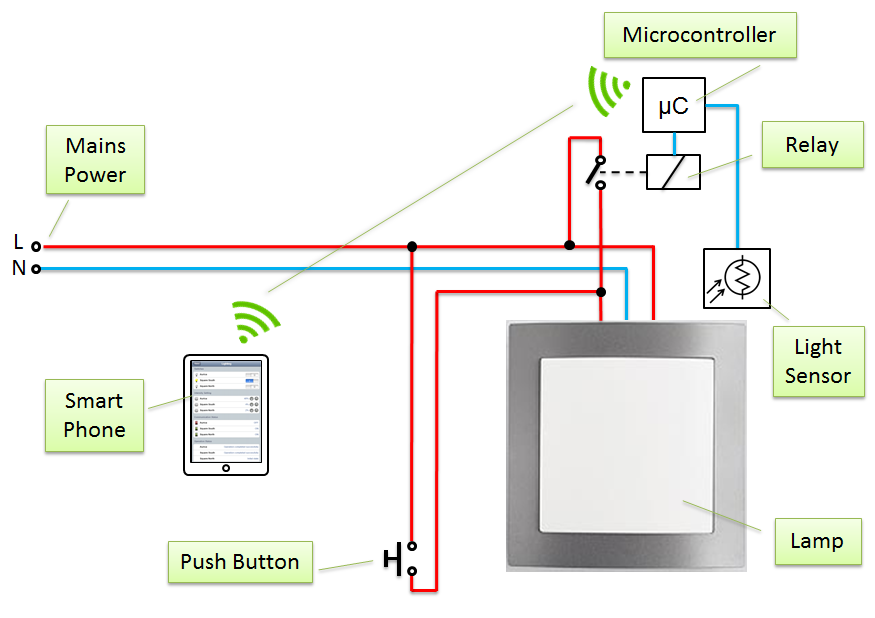
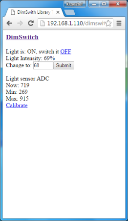
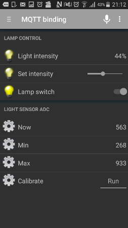

# DimSwitch

This is an Arduino library to control electronic dimmable ballasts for fluorescent light tubes.

It works with ESP8266, Arduino UNO, Micro, MEGA, DUE and other compatible Arduino boards.

For description of API and application examples, please refer to [documentation](extras/) section. You will find there also description and graphs of [state machine sequence, wave-forms](extras/sms-and-wvf.md) of control signals as well as sample [user interface](examples/openhab) in openHAB.

This library is a spin-off of project [esp-lamp-in-sw](https://github.com/krzychb/esp-lamp-in-sw) written in C language. Check it out if  you are not convinced with using C++ for embedded systems.

| **Warning:**  | **Hazardous Voltage!** |
| --- | --- |
|  |  Building and testing hardware for this project involves working with mains power that is dangerous to your life. Do not connect this project to the mains power without proper training and certification! Please read [Safety Guidelines for High Voltage and/or Line Powered Equipment](http://www.repairfaq.org/REPAIR/F_safety.html) |

## Tested with

* [Philips HF-REGULATOR Touch and Dim HF-R T 236 220-240](extras/pictures/PHILIPS-HF-REGULATOR-TOUCH-a-DALI 18-58w-T8- 1-a-2-LAMPS.pdf)
* [OSRAM QUICKTRONIC - INTELLIGENT QTi DALI 2x28/54 DIM](extras/pictures/data-sheet-for-product-families-osram-qti-dali-dim.pdf)

## Functions

* Switch the lamp on / off
* Dim to specific light intensity
* Read back on/off status and intensity
* Calibrate

## Required

* ESP8266 or other Arduino compatible board
* Relay connected to one of outputs
* Light sensor connected to one of analog inputs
* Touch and dim lamp connected to the relay

## Application Example

## Sample Control Screens

This library features example sketches and openHAB code to show options to control the lamp using:
  1. Arduino IDE Serial Monitor
  2. Web browser with simple HTML code
  3. OpenHAB with MQTT binding
  4. OpenHAB with HTTP binding

The last three option are presented on screen shoots below.

|  |  |  |
| --- | --- | --- |
| Web browser with simple HTML code | openHAB with MQTT binding | openHAB with HTTP binding |

## Contribute

Feel free to contribute to the project in any way you like! 

If you find any issues with code or descriptions please report them using *Issues* tab above. 

## Author

krzychb

## Donations

Invite me to freshly squeezed orange juice.

## Credits

Software for this project has been prepared thanks to great work of the following teams and individuals:
* Arduino team that develops and maintains versatile [Arduino IDE](https://www.arduino.cc/)
* [Mikhail Grigorev](https://github.com/CHERTS) who developed [Project Unofficial Development Kit for Espressif ESP8266](http://programs74.ru/udkew-en.html) that let me quickly go up to speed with ESP8266 programming in C language 
* esp8266/Arduino team lead by [Ivan Grokhotkov](https://twitter.com/i_grr) that brought to us great [ESP8266 core for Arduino](https://github.com/esp8266/Arduino)

## License

[GNU LESSER GENERAL PUBLIC LICENSE - Version 2.1, February 1999](LICENSE)
