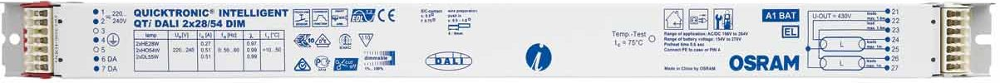
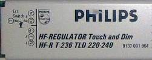
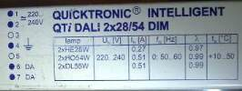
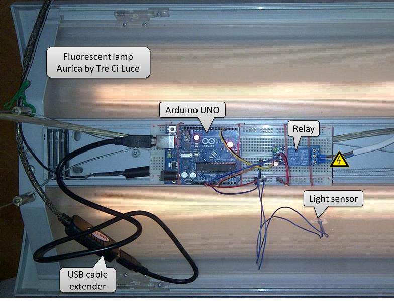

## Introduction

DimSwitch is an Arduino library to control electronic dimmable ballasts for fluorescent light tubes.



It works with ESP8266, Arduino UNO, Micro, MEGA, DUE and other compatible Arduino boards.

| **Warning:**  | **Hazardous Voltage!** |
| --- | --- |
|  |  Building and testing hardware for this project involves working with mains power that is dangerous to your life. Do not connect this project to the mains power without proper training and certification! Please read [Safety Guidelines for High Voltage and/or Line Powered Equipment](http://www.repairfaq.org/REPAIR/F_safety.html) |


## Functions

* Switch the lamp on / off
* Dim to specific light intensity
* Read back on/off status and intensity
* Calibrate


## Required

* ESP8266 or other Arduino compatible board
* Relay connected to one of outputs
* Light sensor connected to one of analog inputs
* Touch and dim lamp connected to the relay


## Electronic Ballasts

Operation of this library has been verified with the following ballasts:

| [Philips HF-REGULATOR Touch and Dim HF-R T 236 220-240](pictures/PHILIPS-HF-REGULATOR-TOUCH-a-DALI 18-58w-T8- 1-a-2-LAMPS.pdf) | [OSRAM QUICKTRONIC - INTELLIGENT QTi DALI 2x28/54 DIM](pictures/data-sheet-for-product-families-osram-qti-dali-dim.pdf) |
| ---- | ---- |
| [](pictures/PHILIPS-HF-REGULATOR-TOUCH-a-DALI 18-58w-T8- 1-a-2-LAMPS.pdf) | [](pictures/data-sheet-for-product-families-osram-qti-dali-dim.pdf) |


## Typical Application Example


## Examples

There are two Arduino [example](../examples) sketches provided that have been tested with real h/w as described below.


### ESP8266

The cheapest, self-contained application of DimSwitch library is for hardware like ES8266 that has all required I/Os and Wi-Fi functionality on a single board.

[DimSwitchTester-ESP.ino](../examples/DimSwitchTester-ESP)

Controlling the lamp is possible by clicking the links on a simple web page. This web and links are prepared for easy integration with openHAB using [HTTP binding](https://github.com/openhab/openhab/wiki/Http-Binding).


 

### Arduino UNO

The simplest and minimum application of DimSwitch library is using Arduino avr boards like Arduino UNO or Micro.

[DimSwitchTester.ino](../examples/DimSwitchTester)

Controlling the lamp in this particular example is done from a keyboard using Arduino IDE Serial Monitor and is intended for less experienced users. Once you get familiar and comfortable using this example, go wireless using ESP8266 module in example above or try other types of wireless connections like RF 315/433 MHz, [nRF24L01](http://playground.arduino.cc/InterfacingWithHardware/Nrf24L01), Bluetooth, [etc.](http://playground.arduino.cc/Main/InterfacingWithHardware)




## API


### Declarations

To include DimSwitch library in your sketch you need to add the following declarations:

```cpp
#include "DimSwitch.h"
#define LIGHT_INTENSITY A0
#define LIGHT_SWITCH 5
DimSwitch lamp(LIGHT_INTENSITY, LIGHT_SWITCH);
```

First line is to include DimSwitch library into your sketch. Next two lines define analog input (A0 in example above) to read light intensity and digital output (pin 5 in above example) to control relay that is operating the lamp ballast. The last line contains DimSwitch object constructor.

Then you should include ``` lamp.runSequence() ``` in your ``` loop() ```. This line will be calling time critical state machine sequence that is operating control relay in response to incoming commands. The code inside ``` loop() ```should not be blocked, so the state machine sequence is executed every couple of milliseconds.


```cpp
void loop(void)
{
  (...)
  lamp.runSequence();
  
  (...)
}
```

The state machine sequence is responsible for cycling the relay to predefined timing to switch the lamp on or off, set intensity or to calibrate light intensity measurement. 

Specific details on executing such operations are provided in chapters below.


### Functions

The following functions are used to read information about status of the lamp.

```cpp
int readIntensityCounts(void);
int readIntensityPercent(void);
bool getState(void);
```
Operation of relay is done with the following functions. 

```cpp
void toggle(void);
void power(bool state);
void calibrate(void);
void setIntensity(int targetIntensityPercent);
void quit(void);
```

Description of both groups of function is provided below.


#### Read Light Intensity

There are two functions read light intensity.

```c
int readIntensityCounts(void);
int readIntensityPercent(void);
```

First one provides raw output of current light intensity that is read from ADC connected to the light sensor. Returned value is an average of predefined number of samples. The number of samples is defined under *MEASURE_SAMPLES* in [DimSwitch.h](../src/DimSwitch.h).

Second function provides percentage of current light intensity in relation of minimum and maximum light intensity values. The minimum and maximum are established by calling [calibration](#calibrate) procedure *calibrate()* that is described below. If calibration is not done then default values will be assumed. Default values are defined as *MIN_INTENSITY* and *MIN_INTENSITY* in [DimSwitch.h](../src/DimSwitch.h).


#### Get State of the Lamp

Use this function to check if lamp is on or off.

```cpp
bool getState(void);
```

If returned value is *true* then the lamp is on, if *false* then off.

#### Toggle Relay

Toggle relay output on for the specific period *TOGGLE_ON_DURATION* in milliseconds and defined in [DimSwitch.h](../src/DimSwitch.h).

```c
#define TOGGLE_ON_DURATION 100
```
Expected result of calling this function will be turning the light on or off, depending on previous state of the lamp. 

```cpp
void:toggle(void)
```

Check: [Code](../src/DimSwitch.cpp#L40-L60) | [Sequence](sms-and-wvf.md#toggle-relay-sequence) | [Wave-forms](sms-and-wvf.md#toggle-relay-wave-forms)

If lamp was previously off, then the lamp will be turned on and vice versa.


#### Power Lamp On and Off

Power the lamp on or off by toggling the output relay. The relay will not be toggled if lamp is already in desired on or off state. 

```cpp
void power(bool state);
```

Check - Power On: [Code](../src/DimSwitch.cpp#L61-L102) | [Sequence](sms-and-wvf.md#power-on-sequence) | [Wave-forms](sms-and-wvf.md#power-on-wave-forms), Power Off: [Code](../src/DimSwitch.cpp#L103-L144) | [Sequence](sms-and-wvf.md#power-off-sequence) | [Wave-forms](sms-and-wvf.md#power-off-wave-forms)

Input parameter *state* should be set *true* to power the lamp on, or *false* to power it off.


#### Calibrate

Execute calibration procedure to establish minimum and maximum light intensity values. 

```cpp
void calibrate(void);
```

Check: [Code](../src/DimSwitch.cpp#L145-L228) | [Sequence](sms-and-wvf.md#calibrate-sequence) | [Wave-forms](sms-and-wvf.md#calibrate-wave-forms)

Calibration is done by ramping light intensity to minimum and maximum. To execute calibration the lamp must be switched on.
 
Until calibration is performed the following default values are assumed according to definition in [DimSwitch.h](../src/DimSwitch.h). 

```c
#define MIN_INTENSITY 300
#define MAX_INTENSITY 1010
```


#### Set Intensity

Set the light intensity to specific percentage of minimum and maximum values established during [calibration](#calibrate).

```cpp
void setIntensity(int targetIntensityPercent);
```

Check: [Code](../src/DimSwitch.cpp#L229-L337) | [Sequence](sms-and-wvf.md#set-intensity-sequence) | [Wave-forms](sms-and-wvf.md#set-intensity-wave-forms)

Input parameter *targetIntensityPercent* range is from 0 to 100 and it represents percentage of light intensity of minimum and maximum values.


#### Quit

Use this function to terminate state machine sequence at any stage. 

```cpp
void quit(void);
```

The control relay will be switched off at first and state machine sequence aborted. When called next time, the state machine will start from initial state.
