## State Machine Sequences and Wave-forms

This section provides additional explanation to particular functions of [API Functions](readme.md#functions) by presenting screenshots of state machine sequence diagrams and wave-forms. All wave-forms were taken during operation of application with DimSwitch library controlling OSRAM QUICKTRONIC - INTELLIGENT QTi DALI 2x28/54 DIM electronic ballast.

### Table of Contents

* [Toggle Relay](#toggle-relay)
  * [Sequence](#toggle-relay-sequence)
  * [Wave-forms](#toggle-relay-wave-forms)
* [Power On](#power-on)
  * [Sequence](#power-on-sequence)
  * [Wave-forms](#power-on-wave-forms)
* [Power Off](#power-off)
  * [Sequence](#power-off-sequence)
  * [Wave-forms](#power-off-wave-forms)
* [Calibrate](#calibrate)
  * [Sequence](#calibrate-sequence)
  * [Wave-forms](#calibrate-wave-forms)
* [Set Intensity](#set-intensity)
  * [Sequence](#set-intensity-sequence)
  * [Wave-forms](#set-intensity-wave-forms)

### Toggle Relay

#### Toggle Relay Sequence

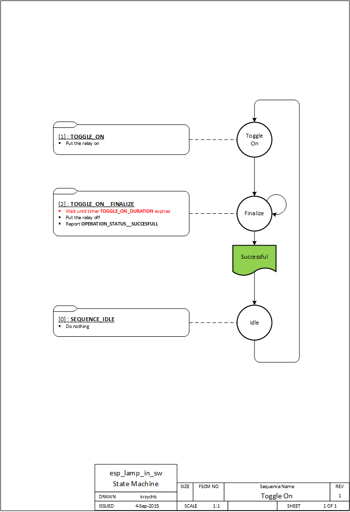

#### Toggle Relay Wave-forms

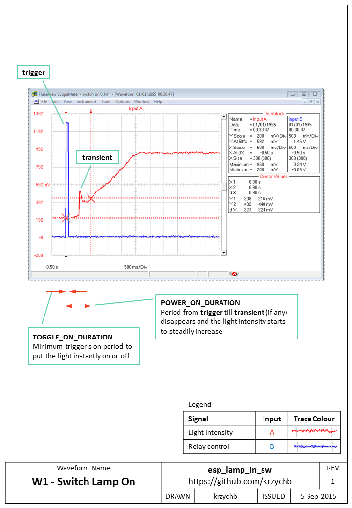

### Power On

#### Power On Sequence

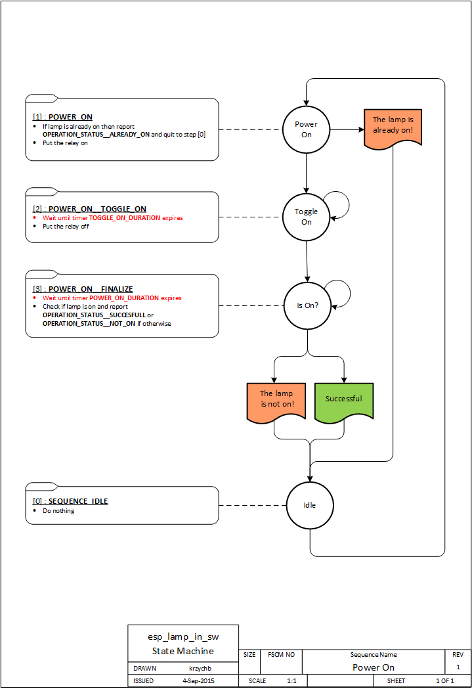

#### Power On Wave-forms

### Power Off

#### Power Off Sequence

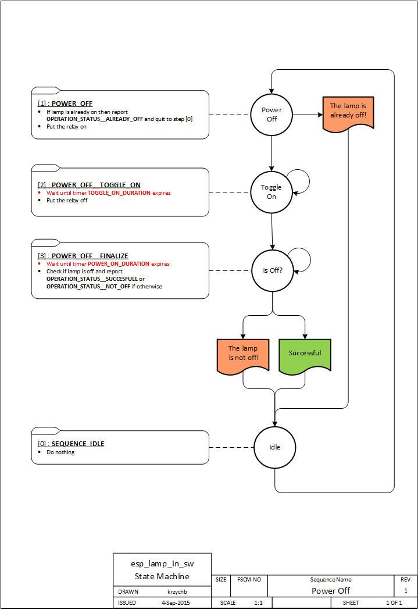

#### Power Off Wave-forms

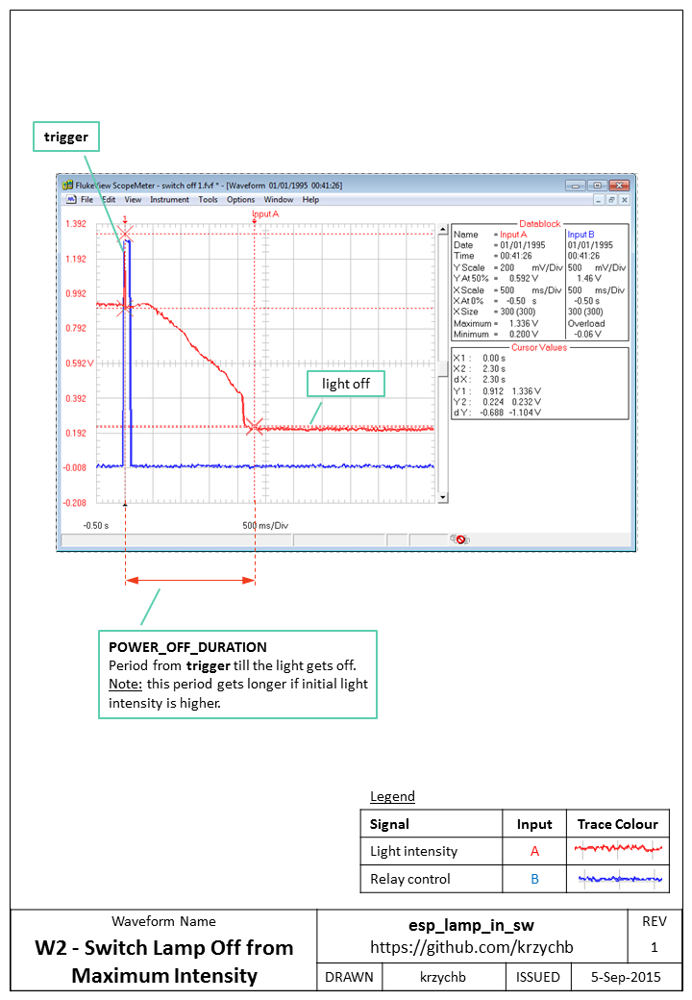
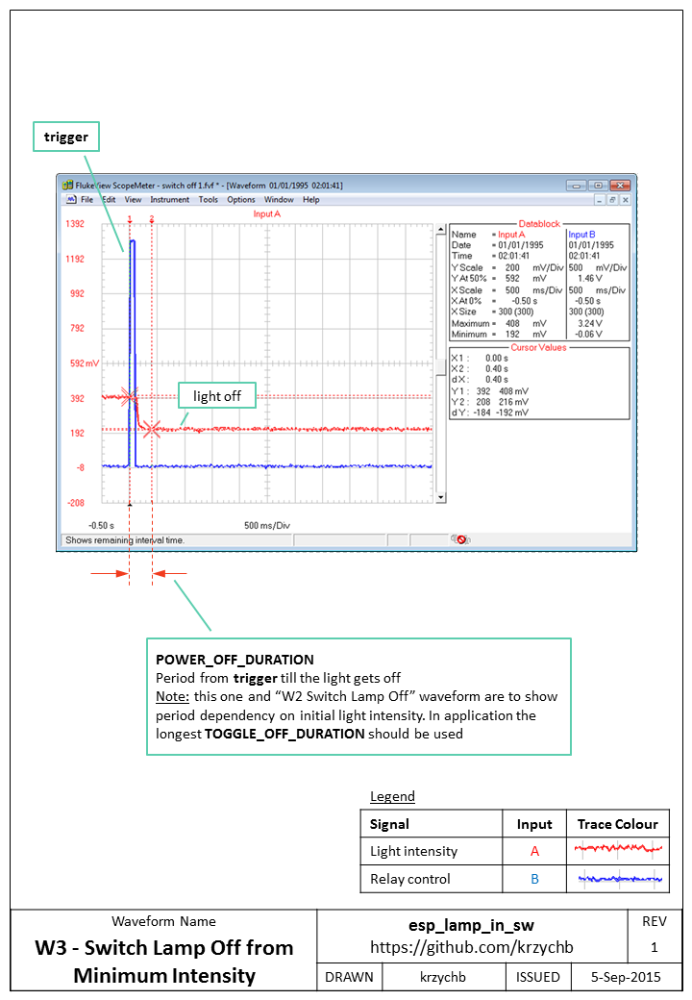

### Calibrate

#### Calibrate Sequence

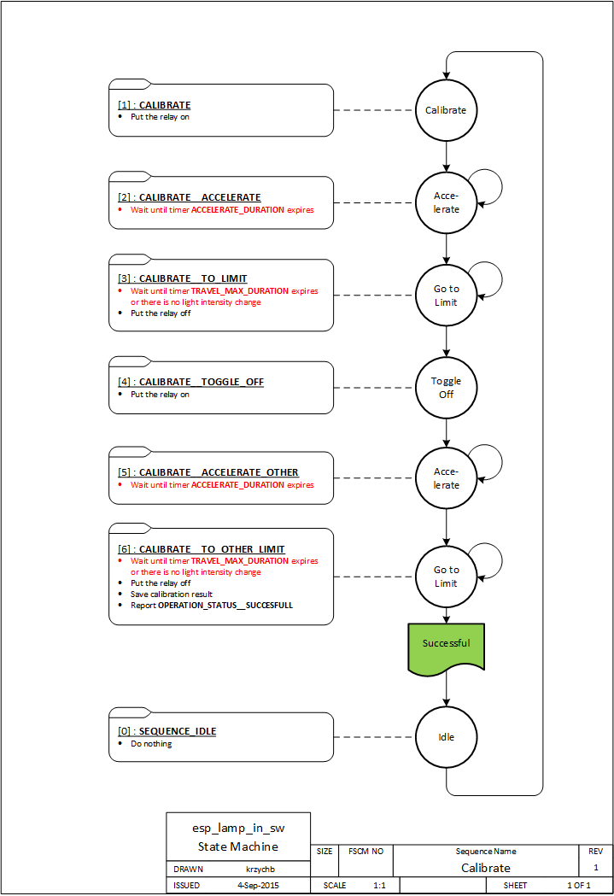

#### Calibrate Wave-forms

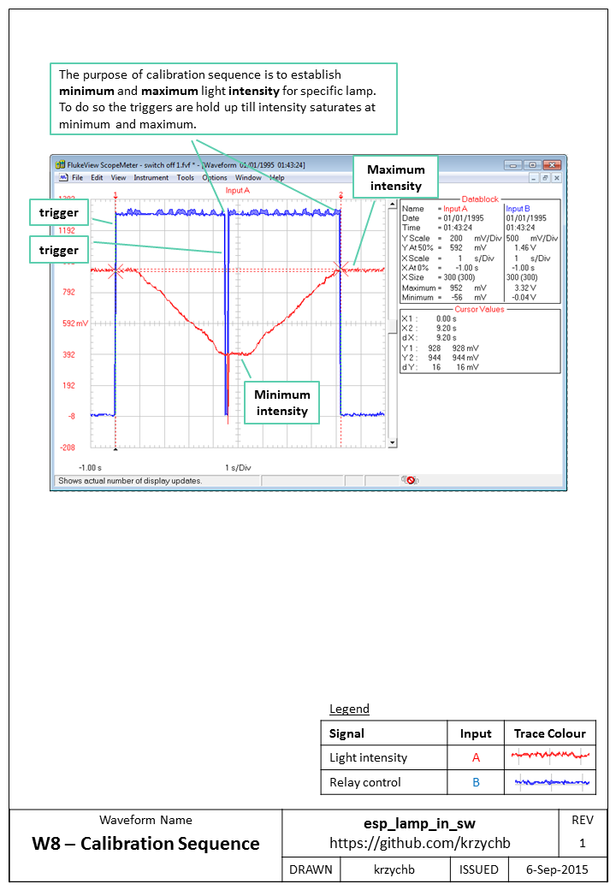
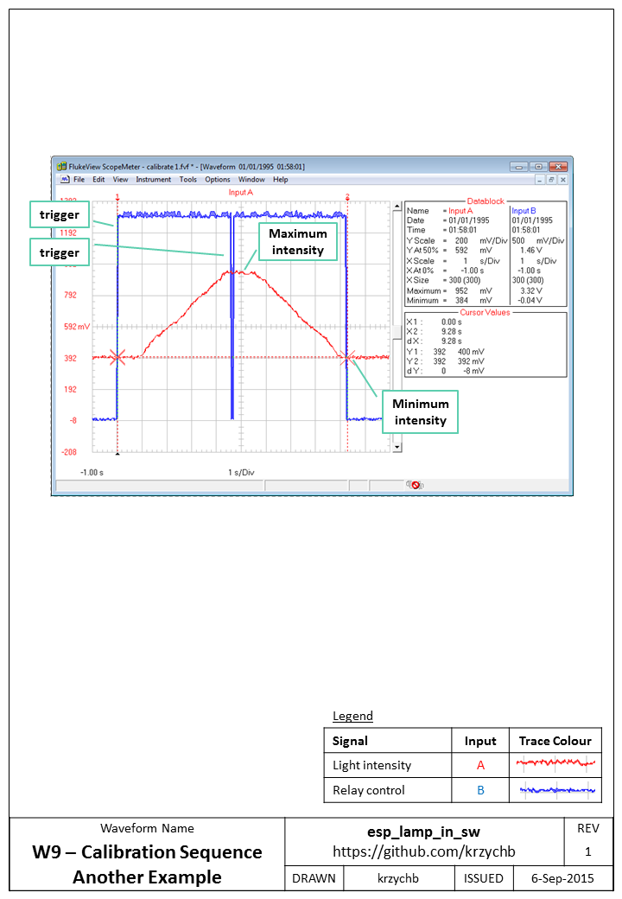

### Set Intensity

#### Set Intensity Sequence

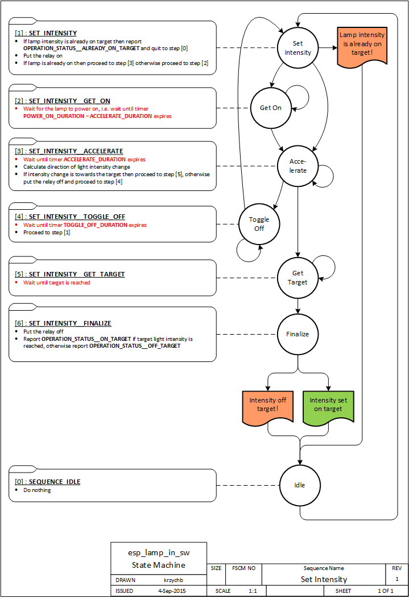

#### Set Intensity Wave-forms

Sequence of setting light intensity depends on initial lamp state (if it is off or already on) and initial direction of intensity change. In later case if initial direction is opposite from desired, the relay is momentary toggled off to change it. See the following wave-forms that illustrate particular cases.

Set the light intensity when the lamp is initially off (below).

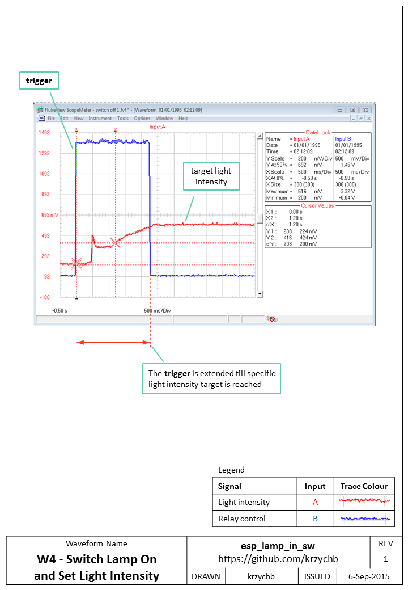

Set the light intensity when the lamp is already on (below).

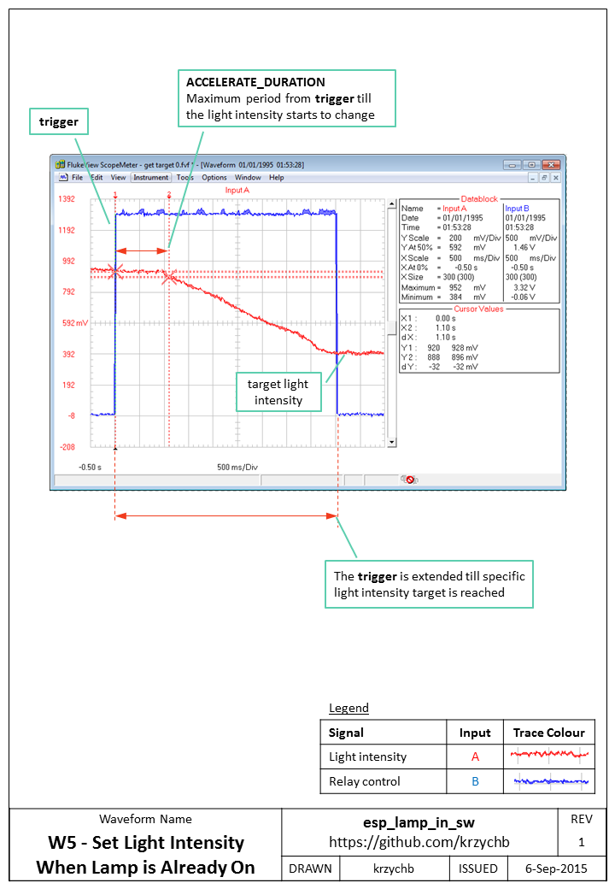

Set the light intensity with altering direction change (below).

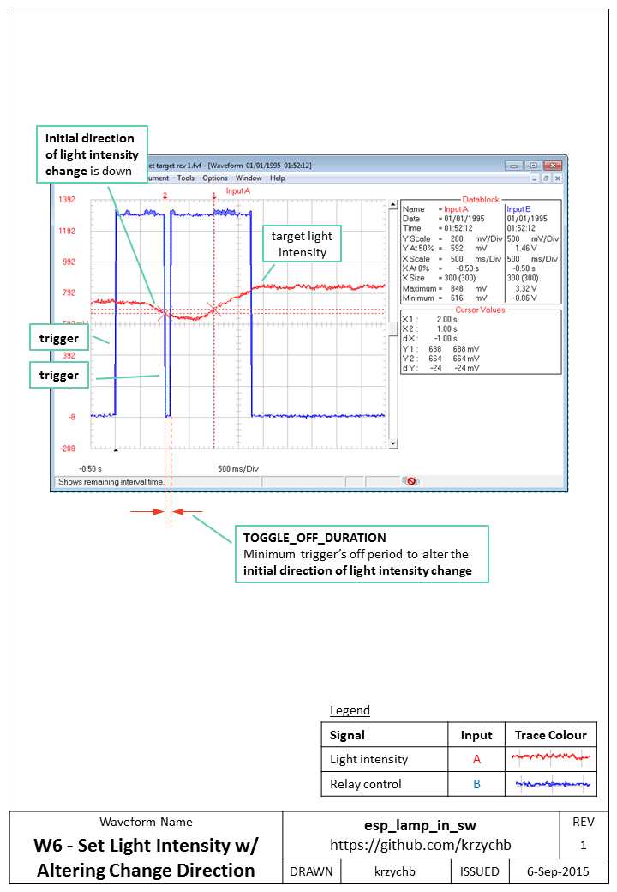

Set the light intensity with altering direction change - another example (below).

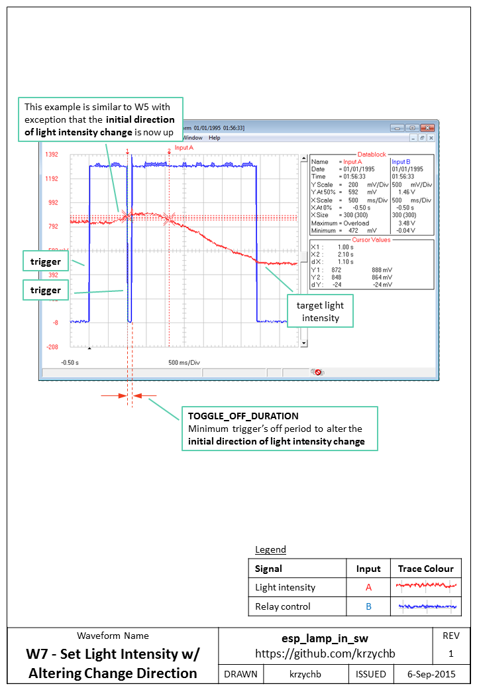
